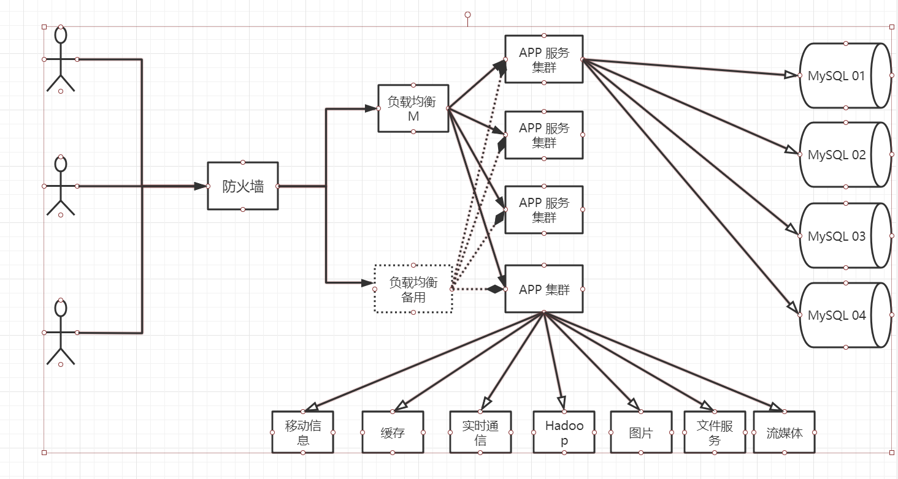

# Redis

## Nosql概述

> 目前的互联网网站的模型



> 为什么使用NoSQL

用户的信息爆炸增长， 传统数据库已经无法满足需求，此时就需要NoSQL的出现

> NoSQL的特点

1. 方便扩展 数据之间没有关系，好扩展（解耦）
2. 大数据量性能高
3. 数据类型多样

``` 
RDBMS与NoSQL
传统关系型数据库
- 结构化组织
- SQL
- 数据和关系都存在单独的表中
- 数据定义语言
- 严格的一致性
- 事务操作
- ......

NoSQL
- 不仅仅是数据
- 没有固定的查询语言
- 键值对存储，列存储，文档存储， 图形数据库
- 最终一致性
- CAP定义和BASE
- 高性能， 高可用， 高可扩
```

## Redis入门

> 什么是Redis

Remote Dictionary Server 远程字典服务


> Redis的功能

1. 内存存储， 持久化， 内存中是断电即失，所以需要持久化， 持久化， rdb， aof
2. 效率高， 可用于高速缓存
3. 发布订阅系统
4. 地图信息分析
5. 计时器、计数器
6. ……

> 特性

1. 多样化的数据
2. 持久化
3. 集群
4. 事务qa
5. ……

> windows 和 Linux 环境下部署 redis

```bash
Redis不推荐在Windows下部署
因此我们在Linux上部署
使用Centos 7

```

> Redis 性能测试

redis-benchmark 是Redis官方提供的压力测试工具


> Redis是单线程

Redis是基于内存操作，CPU不是Redis的性能瓶颈，Redis的瓶颈是机器的内存和带宽，所以单线程来实现足够。

Redis是C语言写的，官方提供的数据为100000+的QPS，完全不比同样key-value的mencache慢

### Redis为什么单线程还这么快

Redis是将所有的数据都存放在内存中，单线程足够快，如果使用多线程， 需要上下文切换，效率并不快。对于内存系统来说，没有上下文切换的效率更高

单线程可维护性高，避免多线程引入带来加锁解锁，甚至是死锁的问题

对于Redis而言，影响其运行速度的不是CPU， 而是内存和和网络带宽

redis内部有AE事件模型和IO多路复用技术等，其处理性能极佳

==Redis 6.0之后支持多线程==

原因：

1. 可以充分利用服务器多CPU的资源，目前的主线程只使用一个核

2. 多线程可以分摊Redis同步IO读写负荷

​	==默认不开启==

~~~ bash
io-threads-do-reads  no
io-threads 4
~~~

**流程简述如下**：

1、主线程负责**接收建立连接请求**，获取 *socket* 放入全局等待读处理队列
2、主线程处理完读事件之后，通过 RR(Round Robin) 将这些连接分配给这些 **IO 线程**
3、主线程**阻塞**等待 IO 线程读取 socket 完毕
4、主线程通过单线程的方式执行请求命令，请求数据读取并解析完成，但并不执行
5、主线程阻塞等待 IO 线程将数据**回写 socket** 完毕
6、解除绑定，清空等待队列

上述的特点

> IO同时进行读操作或者写操作， 不存在同时读写操作
>
> IO线程只负责读写Socket解析命令，不负责处理

注意：

==Redis的多线程部分只是用来处理网络数据的读写和协议解析，执行命令仍然是单线程顺序执行==

多路复用主要有三种技术：**select，poll，epoll**

采用多路 I/O 复用技术可以让单个线程高效的处理多个连接请求（尽量减少网络IO的时间消耗），且Redis在内存中操作数据的速度非常快（内存内的操作不会成为这里的性能瓶颈），主要以上两点造就了Redis具有很高的吞吐量。

## 五大基本数据类型

### Redis-key

``` bash
keys * # 查看所有的keys
EXIST key # 查看key是否存在
del key # 删除key
ttl key # 查看当前key的剩余时间
flushall # 清理所有的数据库
fluashdb # 清空当前的数据库表
type key # 查看当前key的类型
```

### String

```bash
127.0.0.1:6379> set k1 v1\
OK
127.0.0.1:6379> get k1
"v1\\"
127.0.0.1:6379> EXISTS k1
(integer) 1
127.0.0.1:6379> APPEND k1 "hello" # 追加， 如果key不存在，相当于setkey
(integer) 8
127.0.0.1:6379> get k1
"v1\\hello"
127.0.0.1:6379> STRLEN k1
(integer) 8


127.0.0.1:6379> set view 1
OK
127.0.0.1:6379> INCR biew # 自增
(integer) 1
127.0.0.1:6379> INCR view 
(integer) 2
127.0.0.1:6379> INCR view
(integer) 3
127.0.0.1:6379> decr view # 自减
(integer) 2
127.0.0.1:6379> INCRBY view 2 # 自增步长
(integer) 4
127.0.0.1:6379> DECRBY view 2 # 自减步长
(integer) 2
127.0.0.1:6379> 127.0.0.1:6379> set key1 "JamesZhan"
OK
127.0.0.1:6379> GETRANGE key1 0 4 # 获取范围内的内容
"James"
127.0.0.1:6379> SETRANGE key1 1 *** #替换指定位置的字符串
(integer) 9
127.0.0.1:6379> get key1
"J***sZhan"
########################################################
# setex (set expire) # 设置过期时间
# setnx (set not exist) # 不存在设置 分布式锁中常用

#设置多个值
mset k1, v1, k2,v2
mget k1, k2
#同理
msetnx k1 v2
# Redis一条命令中均为原子性操作


# 对象
127.0.0.1:6379> mset user:1:name zhangsan user:1:age 4
OK
127.0.0.1:6379> mget user:1:name user:1:age
1) "zhangsan"
2) "4"

# getset
127.0.0.1:6379> getset db redis
(nil)
127.0.0.1:6379> get db
"redis"
127.0.0.1:6379> getset db mongodb
"redis"
127.0.0.1:6379> get db
"mongodb"
# 更新操作


```

- 计数器
- 统计多单位数量
- 对象缓存存储！

### List

```bash
127.0.0.1:6379> LPUSH list one # 将一个或多个插入到头部 RPUSH 尾部插入
(integer) 1
127.0.0.1:6379> LPUSH list two
(integer) 2
127.0.0.1:6379> LRANGE list 0 -1
1) "two"
2) "one"
# 移除第一个， RPOP移除最后一个
127.0.0.1:6379> LPOP list
"two"

# 通过下标获取
127.0.0.1:6379> LINDEX list 1
"four"
# 获取长度
127.0.0.1:6379> LLEN list
(integer) 2

# 删除指定的值
127.0.0.1:6379> LREM list 1 one
(integer) 1
127.0.0.1:6379> LRANGE list 0 -1
1) "four"
127.0.0.1:6379> LPUSH list four
(integer) 2
127.0.0.1:6379> LPUSH list three
(integer) 3
127.0.0.1:6379> LREM list 2 four
(integer) 2
127.0.0.1:6379> LRANGE list 0 -1
1) "three"

ltrim 裁剪
#移除添加到新的列表中
lpoppush list1 list2

#lset将列表中指定下标的值替换，如果不存在，会报错

# 将内容插入到值定key的前面或者后面
# LINSERT key before/after value

```

> 小结

- 实际上是一个链表

### Set

```bash
127.0.0.1:6379> SADD mset hello  # 添加
(integer) 1
127.0.0.1:6379> SADD mset world
(integer) 1
127.0.0.1:6379> SADD mset redis
(integer) 1

127.0.0.1:6379> SMEMBERS mset # 查看元素
1) "world"
2) "hello"
3) "redis"

127.0.0.1:6379> SISMEMBER mset hello # 判断是否存在
(integer) 1

127.0.0.1:6379> SCARD mset # 获取set集合中的个数
(integer) 3

127.0.0.1:6379> SREM mset hello # 移除
(integer) 1
127.0.0.1:6379> SMEMBERS mset
1) "world"
2) "redis"

127.0.0.1:6379> SRANDMEMBER mset  # 随机取值
"world"
127.0.0.1:6379> SRANDMEMBER mset
"world"
127.0.0.1:6379> SRANDMEMBER mset 2 # 随机取多个值
1) "world"
2) "redis"

127.0.0.1:6379> spop mset # 随机移除一个值
"redis"

127.0.0.1:6379> smove mset mset2 "world" # 移动到另外的set
(integer) 1
127.0.0.1:6379> SMEMBERS mset
1) "hello"
127.0.0.1:6379> SMEMBERS mset2
1) "world"
2) "james"

127.0.0.1:6379> SDIFF mset mset2 # 差集
1) "hello"
127.0.0.1:6379> SINTER mset mset2 # 交集
(empty list or set)
127.0.0.1:6379> sunion mset mset2 # 并集
1) "world"
2) "hello"
3) "james"


```

### Hash

```bash
127.0.0.1:6379> hset myhash field1 james
(integer) 1
127.0.0.1:6379> hget myhash field1
"james"
127.0.0.1:6379> HSET myhash field2 hello
(integer) 1
127.0.0.1:6379> HGETALL myhash # 获取全部的数据
1) "field1"
2) "james"
3) "field2"
4) "hello"

127.0.0.1:6379> HDEL myhash field1 # 删除值定的键值对
(integer) 1
127.0.0.1:6379> HGETALL myhash
1) "field2"
2) "hello"

127.0.0.1:6379> HLEN myhash # 长度
(integer) 3

127.0.0.1:6379> HEXISTS myhash field1 # 判断key是否存在
(integer) 1
127.0.0.1:6379> HEXISTS myhash field4
(integer) 0

# 自增自减
127.0.0.1:6379> HSET myhash field5 3
(integer) 1
127.0.0.1:6379> HINCRBY myhash field5 3
(integer) 6
127.0.0.1:6379> HGET myhash field5
"6"


```


### Zset

底层使用跳表实现

```bash
127.0.0.1:6379> ZADD MYSET 1 ONE
(integer) 1
127.0.0.1:6379> ZADD MYSET 2 TWO 3 THREE
(integer) 2
127.0.0.1:6379> ZRANGE MYSET 0 1
1) "ONE"
2) "TWO"
127.0.0.1:6379> ZADD SALARY 5000 XIAOHONG
(integer) 1
127.0.0.1:6379> ZADD SALARY 3000 ZHANGSAN
(integer) 1
127.0.0.1:6379> ZRANGEBYSCORE SALARY -INF +INF #按照salary 从小到大排序
1) "ZHANGSAN"
2) "XIAOHONG"

127.0.0.1:6379> ZRANGEBYSCORE SALARY -INF +INF WITHSCORES #附带排序内容
1) "ZHANGSAN"
2) "3000"
3) "XIAOHONG"
4) "5000"

127.0.0.1:6379> ZREVRANGE SALARY 0 -1 降序
1) "ZHANGSAN"


127.0.0.1:6379> ZRANGEBYSCORE SALARY -INF 3000 WITHSCORES # 某个范围内所有升序排列

127.0.0.1:6379> ZREM SALARY XIAOHONG # 删除
(integer) 1
127.0.0.1:6379> ZCARD SALARY # 获取总共的个数
(integer) 1

127.0.0.1:6379> ZCOUNT SALARY 1 2 # 获取指定范围内的个数 


```


## 三种特殊的数据类型

### Geospatial

```BASH
# 两极无法添加      经度 纬度 名称
127.0.0.1:6379> ==GEOADD== CHINA:CITY 116.4 39.9 BEIJING
(integer) 1
127.0.0.1:6379> GEOADD CHINA:CITY 121.4 31.23 SHANGHAI
(integer) 1
127.0.0.1:6379> GEOADD CHINA:CITY 106.5 29.5 CHONGQING
(integer) 1
127.0.0.1:6379> GEOADD CHINA:CITY 120.1 30.2 HANGZHOU
(integer) 1
127.0.0.1:6379> GEOADD CHINA:CITY 108.9 34.2 XIAN
(integer) 1
127.0.0.1:6379> GEOADD CHINA:CITY 114.0 22.5 SHENZHENG
(integer) 1


```

> 获取指定城市的经纬度

```bash
# 获取值定的经纬度， 获得当前的定位
127.0.0.1:6379> ==GEOPOS== CHINA:CITY BEIJING
1) 1) "116.39999896287918091"
   2) "39.90000009167092543"
```

> 两个城市之间的距离

```bash
127.0.0.1:6379> ==GEODIST== CHINA:CITY SHANGHAI BEIJING
"1064686.5127"
127.0.0.1:6379> GEODIST CHINA:CITY SHANGHAI BEIJING km # 指定单位
"1064.6865"
```

单位：

- m 米
- km 千米
- mi 英里
- ft 英尺

> 获取附近的人 georadious 指定范围内的人

```bash
127.0.0.1:6379> GEORADIUS CHINA:CITY 110(经度) 30(维度) 1000 km
1) "CHONGQING"
2) "XIAN"
3) "SHENZHENG"
4) "HANGZHOU"

# 获取经纬度
127.0.0.1:6379> GEORADIUS CHINA:CITY 110 30 1000 km withcoord
1) 1) "CHONGQING"
   2) 1) "106.49999767541885376"
      2) "29.50000115408581536"
2) 1) "XIAN"
   2) 1) "108.90000075101852417"
      2) "34.20000025962658441"
3) 1) "SHENZHENG"
   2) 1) "114.00000125169754028"
      2) "22.50000113800319212"
4) 1) "HANGZHOU"
   2) 1) "120.09999901056289673"
      2) "30.19999988833350102"

# 获取距离
127.0.0.1:6379> GEORADIUS CHINA:CITY 110 30 1000 km withdist
1) 1) "CHONGQING"
   2) "342.5131"
2) 1) "XIAN"
   2) "478.4989"
3) 1) "SHENZHENG"
   2) "924.4990"
4) 1) "HANGZHOU"
   2) "971.8350"
   
  # 删选出指定的
  127.0.0.1:6379> ==GEORADIUS== CHINA:CITY 110 30 1000 km withcoord withdist count 2
1) 1) "CHONGQING"
   2) "342.5131"
   3) 1) "106.49999767541885376"
      2) "29.50000115408581536"
2) 1) "XIAN"
   2) "478.4989"
   3) 1) "108.90000075101852417"
      2) "34.20000025962658441"
      
# 找出指定元素周围的内容
127.0.0.1:6379> ==GEORADIUSBYMEMBER== CHINA:CITY BEIJING 1000 km
1) "BEIJING"
2) "XIAN"


```

> GEO 底层的实现原理： ZSet

==删除==

```bash
127.0.0.1:6379> ZRANGE CHINA:CITY 0 -1
1) "CHONGQING"
2) "XIAN"
3) "SHENZHENG"
4) "HANGZHOU"
5) "SHANGHAI"
6) "BEIJING"
127.0.0.1:6379> ZREM CHINA:CITY HANGZHOU
(integer) 1
127.0.0.1:6379> ZRANGE CHINA:CITY 0 -1
1) "CHONGQING"
2) "XIAN"
3) "SHENZHENG"
4) "SHANGHAI"
5) "BEIJING"

```

### Hyperloglog

基数： 不重复的元素， 可接受误差

> Hyperloglog 基数统计的算法

举个栗子：网站的访问量

优点： 占用的内存少， 2^64不同的元素的基数， 占用内存仅为12KB

```bash
# 存储
127.0.0.1:6379> PFADD mykey a b c d f e s d f
(integer) 1
# 基数的个数
127.0.0.1:6379> PFCOUNT mykey
(integer) 7
127.0.0.1:6379> PFADD mykey2 d c d f w e g
(integer) 1
# 合并
127.0.0.1:6379> PFMERGE mykey3 mykey mykey2
OK
127.0.0.1:6379> PFCOUNT mykey3
(integer) 9

```

### BitMaps

> 位存储

两个状态的都可以使用BitMaps， 二进制来进行记录

```bash
27.0.0.1:6379> SETBIT sign 0 1
(integer) 0
127.0.0.1:6379> SETBIT sign 1 0
(integer) 0
127.0.0.1:6379> SETBIT sign 2 0
(integer) 0
127.0.0.1:6379> SETBIT sign 3 1
(integer) 0
127.0.0.1:6379> SETBIT sign 4 1
(integer) 0
127.0.0.1:6379> SETBIT sign 5 0
(integer) 0
127.0.0.1:6379> SETBIT sign 6 0
(integer) 0
# 获取
127.0.0.1:6379> GETBIT sign 3
(integer) 1
# 获取为1的个数
127.0.0.1:6379> bitcount sign
(integer) 3


```

### Redis的事务

> Redis事务的流程

- 开始 （multi）
- 一系列命令
- 执行（exec）

```bash
> multi # 开启事务
# 命令进入队列
> set k1 v1
> set v2 k2
# 执行
> exec
```

> 放弃事务

```bash
DISCARD #取消事务
# 事务队列中的命令都不会执行
```

> 编译异常（代码有错误） ， 事务中的所有事务都不会执行

在Redis中相当于和命令出现错误


> 运行时异常， 遇到异常抛出异常


## Jedis

> 导入依赖

```xml
<dependencies>
        <!-- https://mvnrepository.com/artifact/redis.clients/jedis -->
        <dependency>
            <groupId>redis.clients</groupId>
            <artifactId>jedis</artifactId>
            <version>3.2.0</version>
        </dependency>

        <dependency>
            <groupId>com.alibaba</groupId>
            <artifactId>fastjson</artifactId>
            <version>1.2.58</version>
        </dependency>
    </dependencies>

```

> 编码测试

- 连接数据库

  ```java
  public static void main(String[] args) {
      // 1. new jedis对象
      Jedis jedis = new Jedis("127.0.0.1", 6379);
  
      System.out.println(jedis.ping());
  }
  
  // result PONG
  ```

  常见命令

  ```java
  public static void main(String[] args) {
          // 1. new jedis对象
          Jedis jedis = new Jedis("127.0.0.1", 6379);
  
          System.out.println(jedis.ping());
  
          System.out.println("清空数据:" + jedis.flushDB());
          System.out.println("判断某个键是否存在:" + jedis.exists("username"));
          System.out.println("新增username:"+ jedis.set("username", "James"));
          System.out.println("新增password:" + jedis.set("password", "123456"));
          System.out.println("系统中所有的键如下:");
          Set<String> keys = jedis.keys("*");
          System.out.println(keys);
          System.out.println("删除password:" + jedis.del("password"));
          System.out.println("判断是否存在password:" + jedis.exists("password"));
          System.out.println("查看username:" + jedis.get("username"));
          System.out.println("查看username的类型:" + jedis.type("username"));
          System.out.println("随机返回一个key：" + jedis.randomKey());
          System.out.println("重命名:" + jedis.rename("username", "name"));
          System.out.println("取出name的值:" + jedis.get("name"));
          System.out.println("切换数据库:" + jedis.select(0));
          System.out.println("删除所有:" + jedis.flushDB());
          System.out.println("返回当前数据中的所有key:" + jedis.dbSize());
          System.out.println("删除整个redis中的内容:" + jedis.flushAll());
      }
  ```

  结果

  ```bash
  
  PONG
  清空数据:OK
  判断某个键是否存在:false
  新增username:OK
  新增password:OK
  系统中所有的键如下:
  [password, username]
  删除password:1
  判断是否存在password:false
  查看username:James
  查看username的类型:string
  随机返回一个key：username
  重命名:OK
  取出name的值:James
  切换数据库:OK
  删除所有:OK
  返回当前数据中的所有key:0
  删除整个redis中的内容:OK
  ```

  

- 编写命令

- 断开连接


###  Jedis 事务

```java
    public static void main(String[] args) {

        // 1. new jedis对象
        Jedis jedis = new Jedis("127.0.0.1", 6379);

        JSONObject jsonObject = new JSONObject();
        jsonObject.put("hello", "james");
        String result = jsonObject.toJSONString();

        // 开启事务
        Transaction tx = jedis.multi();

        try{

            tx.set("user1", result);
            tx.set("user2", result);
            // 执行事务
            tx.exec();
        }catch (Exception e){
            // 放弃事务
            tx.discard();
            e.printStackTrace();
        }finally {
            System.out.println(jedis.get("user1"));
            System.out.println(jedis.get("user2"));

            //关闭连接
            jedis.close();
        }
    }
```


## SpringBoot整合

> SpringBoot 2.x 之后，原来使用的jedis被替换成lettuce

原因：

- jedis: 采用的直连， 多个线程操作是不安全的， 若使用多线程进行操作则使用jedis pool ， BIO
- lettuce： 采用netty， 实例可以在多个线程中共享，不存在线程不安全的情况！减少线程数量， 更像NIO模式


> ```
> spring-boot-starter-data-redis包的底层依赖
> ```

```xml
  <dependencies>
    <dependency>
      <groupId>org.springframework.boot</groupId>
      <artifactId>spring-boot-starter</artifactId>
      <version>2.2.11.RELEASE</version>
      <scope>compile</scope>
    </dependency>
    <dependency>
      <groupId>org.springframework.data</groupId>
      <artifactId>spring-data-redis</artifactId>
      <version>2.2.11.RELEASE</version>
      <scope>compile</scope>
      <exclusions>
        <exclusion>
          <artifactId>jcl-over-slf4j</artifactId>
          <groupId>org.slf4j</groupId>
        </exclusion>
      </exclusions>
    </dependency>
    <dependency>
      <groupId>io.lettuce</groupId>
      <artifactId>lettuce-core</artifactId>
      <version>5.2.2.RELEASE</version>
      <scope>compile</scope>
    </dependency>
  </dependencies>
```


Redis在autoconfigure中的配置如下：

```java
@Configuration(proxyBeanMethods = false)
@ConditionalOnClass(RedisOperations.class)
@EnableConfigurationProperties(RedisProperties.class)
@Import({ LettuceConnectionConfiguration.class, JedisConnectionConfiguration.class })
public class RedisAutoConfiguration {

	@Bean
	@ConditionalOnMissingBean(name = "redisTemplate")// redisTemplate可以自己配置
	public RedisTemplate<Object, Object> redisTemplate(RedisConnectionFactory redisConnectionFactory)
			throws UnknownHostException {
		RedisTemplate<Object, Object> template = new RedisTemplate<>();
		template.setConnectionFactory(redisConnectionFactory);
		return template;
	}

    //Spring较为常用因此单独一个Template
	@Bean
	@ConditionalOnMissingBean
	public StringRedisTemplate stringRedisTemplate(RedisConnectionFactory redisConnectionFactory)
			throws UnknownHostException {
		StringRedisTemplate template = new StringRedisTemplate();
		template.setConnectionFactory(redisConnectionFactory);
		return template;
	}

}
```


### 导入依赖包

```xml
<dependencies>
    <dependency>
        <groupId>org.springframework.boot</groupId>
        <artifactId>spring-boot-starter-data-redis</artifactId>
    </dependency>
    <dependency>
        <groupId>org.springframework.boot</groupId>
        <artifactId>spring-boot-starter-web</artifactId>
    </dependency>

    <dependency>
        <groupId>org.springframework.boot</groupId>
        <artifactId>spring-boot-devtools</artifactId>
        <scope>runtime</scope>
        <optional>true</optional>
    </dependency>
    <dependency>
        <groupId>org.springframework.boot</groupId>
        <artifactId>spring-boot-configuration-processor</artifactId>
        <optional>true</optional>
    </dependency>
    <dependency>
        <groupId>org.projectlombok</groupId>
        <artifactId>lombok</artifactId>
        <optional>true</optional>
    </dependency>
    <dependency>
        <groupId>org.springframework.boot</groupId>
        <artifactId>spring-boot-starter-test</artifactId>
        <scope>test</scope>
        <exclusions>
            <exclusion>
                <groupId>org.junit.vintage</groupId>
                <artifactId>junit-vintage-engine</artifactId>
            </exclusion>
        </exclusions>
    </dependency>
</dependencies>
```

### 配置

```properties
spring.redis.host=127.0.0.1
spring.redis.port=6379
```


### 测试

```java
@SpringBootTest
class Redis02SpringbootApplicationTests {

    @Autowired
    private RedisTemplate redisTemplate;

    @Test
    void contextLoads() {

//        redisTemplate
//        opsForValue 字符串操作
//        opsForList
//        opsForHash
//        opsForSet
//        opsForZSet
//        opsForGeo


//        redis 的连接对象
//        RedisConnection connection = redisTemplate.getConnectionFactory().getConnection();
//        connection.flushDb();

        redisTemplate.opsForValue().set("mykey", "JamesTestKey");
        System.out.println(redisTemplate.opsForValue().get("mykey"));
    }

}
```


### RedisTemplate 解读

> Redis的序列化


```java
this.defaultSerializer = new JdkSerializationRedisSerializer(this.classLoader != null ? this.classLoader : this.getClass().getClassLoader());
```

默认使用JDK序列化进行序列化


### 自定义RedisTemplate

```java
@Configuration
public class RedisConfig {

    // 定义自己的RedisTemplate

    @Bean
    public RedisTemplate<String, Object> redisTemplate(RedisConnectionFactory redisConnectionFactory)
            throws UnknownHostException {
//        常见的String-> Object 类型
        RedisTemplate<String, Object> template = new RedisTemplate<>();
        template.setConnectionFactory(redisConnectionFactory);
//        序列化配置
//        json的序列化配置
        Jackson2JsonRedisSerializer jackson2JsonRedisSerializer =  new Jackson2JsonRedisSerializer<>(Object.class);
        ObjectMapper om = new ObjectMapper();
        om.setVisibility(PropertyAccessor.ALL, JsonAutoDetect.Visibility.ANY);

        jackson2JsonRedisSerializer.setObjectMapper(om);
//        string的序列化
        StringRedisSerializer stringRedisSerializer = new StringRedisSerializer();

//        key采用string的方式序列化
        template.setKeySerializer(stringRedisSerializer);
//        hash的key也采用string的序列化方式
        template.setHashKeySerializer(stringRedisSerializer);
//        value序列化方式采用Jackson2JsonRedisSerializer
        template.setValueSerializer(jackson2JsonRedisSerializer);
//        hash 的value也采用jackson2JsonRedisSerializer序列化
        template.setHashValueSerializer(jackson2JsonRedisSerializer);

//        将所有的properties set
        template.afterPropertiesSet();
        return template;
    }

}
```


## Redis 配置文件

> 配置单位大小写不敏感

```bash
# Redis configuration file example.
#
# Note that in order to read the configuration file, Redis must be
# started with the file path as first argument:
#
# ./redis-server /path/to/redis.conf

# Note on units: when memory size is needed, it is possible to specify
# it in the usual form of 1k 5GB 4M and so forth:
#
# 1k => 1000 bytes
# 1kb => 1024 bytes
# 1m => 1000000 bytes
# 1mb => 1024*1024 bytes
# 1g => 1000000000 bytes
# 1gb => 1024*1024*1024 bytes
#
# units are case insensitive so 1GB 1Gb 1gB are all the same.

```

> config 包含

```bash
################################## INCLUDES ###################################

# Include one or more other config files here.  This is useful if you
# have a standard template that goes to all Redis servers but also need
# to customize a few per-server settings.  Include files can include
# other files, so use this wisely.
#
# Notice option "include" won't be rewritten by command "CONFIG REWRITE"
# from admin or Redis Sentinel. Since Redis always uses the last processed
# line as value of a configuration directive, you'd better put includes
# at the beginning of this file to avoid overwriting config change at runtime.
#
# If instead you are interested in using includes to override configuration
# options, it is better to use include as the last line.
#
# include /path/to/local.conf
# include /path/to/other.conf

```

> 网络配置

```bash
################################## NETWORK #####################################

# By default, if no "bind" configuration directive is specified, Redis listens
# for connections from all the network interfaces available on the server.
# It is possible to listen to just one or multiple selected interfaces using
# the "bind" configuration directive, followed by one or more IP addresses.
#
# Examples:
#
# bind 192.168.1.100 10.0.0.1
# bind 127.0.0.1 ::1
#
# ~~~ WARNING ~~~ If the computer running Redis is directly exposed to the
# internet, binding to all the interfaces is dangerous and will expose the
# instance to everybody on the internet. So by default we uncomment the
# following bind directive, that will force Redis to listen only into
# the IPv4 lookback interface address (this means Redis will be able to
# accept connections only from clients running into the same computer it
# is running).
#
# IF YOU ARE SURE YOU WANT YOUR INSTANCE TO LISTEN TO ALL THE INTERFACES
# JUST COMMENT THE FOLLOWING LINE.

bind 127.0.0.1 # 绑定ip 远程连接的时候需要注释
protected-mode yes # 保护模式
port 6379# 端口设置
```


> 通用general

```bash
daemonize yes    # 以守护进程的方式进行 默认为 no
pidfile /var/run/redis_6379.pid # 后台方式运行，需要pid
# Specify the server verbosity level.
# This can be one of:
# debug (a lot of information, useful for development/testing)
# verbose (many rarely useful info, but not a mess like the debug level)
# notice (moderately verbose, what you want in production probably) 生产环境
# warning (only very important / critical messages are logged)
loglevel notice
logfile "" # 日志的文件位置名
database 16 # 默认数据库的数量

```

> 快照 snapshot

持久化， 在规定的时间内，执行了多少次操作， 会持久化到.rdb  .aof

```bash
# 在900s内， 如果至少有一个key进行了修改， 则会出现持久化
save 900 1
# 在300s内， 如果至少有10个key进行了修改， 则会出现持久化
save 300 10
# 在60s内， 如果至少10000个key进行了修改， 则会出现持久化
save 60 10000

# 遇到错误是否继续持久化
stop-writes-on-bgsave-error yes
# 是否压缩rdb文件，需要cpu资源
rdbcompression yes

# 保存rdb文件的时候，进行错误的检查
rdbchecksum yes

dir ./ # rdb 文件目录保存


```


> REPLICATION  主从复制


> SECURITY 安全

```bash
# redis 默认没有密码

127.0.0.1:6379> ping
PONG
127.0.0.1:6379> config get requirepass
1) "requirepass"
2) ""
# 设置密码
127.0.0.1:6379> config set requirepass "123456"
OK
127.0.0.1:6379> config get requirepass
(error) NOAUTH Authentication required.
127.0.0.1:6379> ping
(error) NOAUTH Authentication required.
# 认证
127.0.0.1:6379> auth 123456
OK
127.0.0.1:6379> ping
PONG

```


> 限制clients


```bash
 maxclients 10000 # 最大的client连接数量
 
 maxmemory <bytes> # 最大内存
 
 maxmemory-policy noeviction # 内存到达上限的策略


```

> 面试会问到 maxmemory-policy 六种方式
1、volatile-lru：只对设置了过期时间的key进行LRU（默认值） 

2、allkeys-lru ： 删除lru算法的key   

3、volatile-random：随机删除即将过期key   

4、allkeys-random：随机删除   

5、volatile-ttl ： 删除即将过期的   

6、noeviction ： 永不过期，返回错误

> APPEND ONLY AOF

```bash
appendonly no # 默认不开启aof， 使用rdb
appendfilename "appendonly.aof" # 持久化文件的名称

# appendfsync always  # 每次修改都会sync， 消耗性能
appendfsync everysec # 每秒进行一次sync， 可能会出现丢失
# appendfsync no # 不执行sync， 系统自己同步

```


## Redis 持久化

### RDB （Redis Database）

在指定的时间间隔内， 将内存中的数据集快照写入磁盘， 也就是snapshot快照，恢复时是直接将快照文件读到内存中

会单独创建一个子进程来进行持久化，会先将数据写入到一个临时文件中，持久化过程结束，则由这次的文件进行替换之前的文件。

整个过程中主进程不进行任何IO操作。

进行大规模的数据恢复时， 且对于数据恢复的完整性不是非常敏感，RDB方式相对而言更加的高效。

**缺点**：

最后一次更新的数据可能丢失

==RDB保存的默认文件是dump.rdp==


> 触发机制

1. save规则满足的情况下
2. 执行flushall命令
3. 退出redis

备份自动生成一个dump.rdb

> 恢复rdb

将rdb文件放到redis的启动目录下即可

**优点**：

	1. 适合大规模的数据恢复！
 	2. 对数据的完整性要求不高

**缺点**：

	1. 需要一定对额时间间隔操作，redis意外宕机， 修改会丢失
 	2.  需要fork子进程， 需要占用一定的内存空间

### AOF （Append Only File）

以日志的形式记录每个写操作， 将redis执行过的所有指令记录下来

默认不开启，需要手动开启，

```bash
appendonly no

# The name of the append only file (default: "appendonly.aof")

appendfilename "appendonly.aof"
auto-aof-rewrite-percentage 100
auto-aof-rewrite-min-size 64mb

```


如果aof文件有错误，浙时候redis是无法成功启动的， 需要修复

redis 官方提供的修复工具 `redis-check-aof --fix appendonly.aof ` 

如果文件修复正常， 在可以重启正常

> 优缺点

优点

1. 每次修改都同步，（默认开启为每秒同步）， 则可能丢失一秒的数据

   

缺点

1. 相对数据文件来说， aof远大于rdb， 修复的速度也比较慢
2. aof的运行速度也较慢， 所以redis默认的持久化是rdb

扩展：

同时开启两种持久化方式

- redis重启的时候会优先加载aof文件内来恢复数据
- rdb数据不实时， 但更适用于数据备份， aof不断在变化， 不宜作为备份

性能建议

- 因为RDB文件只用作备份用途，建议在slaver上配置RDB文件，15分钟左右进行一次备份， 保留`save 900 1  `这条规则
- 如果enable AOF好处是最恶劣情况下只会丢失2秒的数据。代价：
  - 持续的IO
  - AOF重写到最后rewrite过程中产生的吧新数据写到新文件不可阻止的产升堵塞。
- 不Enable AOF， 仅仅靠Master-Slave实现高可用也可以， 同时能省下一大笔的IO支出， 也减少了rewrite的波动，但是如果出现slaver和Master同时down掉，会丢失十几分钟的数据


## Redis发布订阅

Redis发布订阅是一种==消息通信模式==，发送者推送消息，订阅者接收消息


> 测试

```bash
# 订阅者
127.0.0.1:6379> SUBSCRIBE JamesZhan
Reading messages... (press Ctrl-C to quit)
1) "subscribe"
2) "JamesZhan"
3) (integer) 1

#发送者发送信息
127.0.0.1:6379> PUBLISH JamesZhan "Hello This is The First Message From James Channel"
(integer) 1
#订阅者接收信息
127.0.0.1:6379> SUBSCRIBE JamesZhan
Reading messages... (press Ctrl-C to quit)
1) "subscribe"
2) "JamesZhan"
3) (integer) 1
1) "message"
2) "JamesZhan"
3) "Hello This is The First Message From James Channel"

```

> 原理

通过SUBSCRIBE命令订阅某个评到之后， redis-server里面维护了一个字典， 字典的key就是一个个频道，而字典的值就是一个个的链表， 保存所有订阅了这个频道的客户都安，SUBSCRIBE的关键是将订阅的客户都安添加到链表当中

通过PUBLISH命令向订阅者发送消息，redis-server会使用给定的频道作为key，遍历订阅的客户端将消息进行发布


## Redis主从复制

==数据的复制是单向的， 只能从主节点到从节点，Master以写为主， Slaver以读为主==

主从复制的作用主要包括：

1. 数据冗余： 主从复制是下了数据的热备份，是持久化之外的数据冗余fangshi
2. 故障恢复： 主节点出现问题的情况下可以由从节点提供服务吗，实现快速的故障恢复
3. 负载均衡： 在主从复制的基础上， 配合读写分离，可以由主节点提供写服务，从节点提供读服务，分担服务器的压力。 尤其在写少读多的情况下，可以通过配置多个节点分担读负载，可以大大提高redis的读的并发量
4. 高可用基石：主从复制是哨兵和集群能够实施的基础。

### 环境配置

只配置从库，不配置主库

```bash
info replication # 查看主从的配置

```

> 修改配置文件

1. 端口
2. logfile name
3. pid名字
4. dumo文件名字

> 启动成功

```bash
[root@localhost src]# ps -ef|grep redis
root       2858      1  0 07:39 ?        00:00:00 redis-server 127.0.0.1:6379
root       2983   2923  0 07:40 pts/1    00:00:00 redis-cli -p 6379
root       3070      1  0 07:40 ?        00:00:00 redis-server 127.0.0.1:6380
root       3161   3127  0 07:40 pts/3    00:00:00 redis-cli -p 6380
root       3256      1  0 07:41 ?        00:00:00 redis-server 127.0.0.1:6381
root       3347   3313  0 07:41 pts/5    00:00:00 redis-cli -p 6381

```


### 一主二从

一主（79） 二从（80， 81）

```bash
slaveof
```


#### slave

```bash
127.0.0.1:6380> SLAVEOF 127.0.0.1 6379
OK
127.0.0.1:6380> info replication
# Replication
role:slave # 角色转变成slaver
# master的信息
master_host:127.0.0.1
master_port:6379
master_link_status:up
master_last_io_seconds_ago:5
master_sync_in_progress:0
slave_repl_offset:14
slave_priority:100
slave_read_only:1
connected_slaves:0
master_replid:47a9ea51f0b6b80b9493a4f38aa41ff4b95e1637
master_replid2:0000000000000000000000000000000000000000
master_repl_offset:14
second_repl_offset:-1
repl_backlog_active:1
repl_backlog_size:1048576
repl_backlog_first_byte_offset:1
repl_backlog_histlen:14

```

#### master

```bash
127.0.0.1:6379> info replication
# Replication
role:master
connected_slaves:1
# 从机的信息
slave0:ip=127.0.0.1,port=6380,state=online,offset=98,lag=1
master_replid:47a9ea51f0b6b80b9493a4f38aa41ff4b95e1637
master_replid2:0000000000000000000000000000000000000000
master_repl_offset:98
second_repl_offset:-1
repl_backlog_active:1
repl_backlog_size:1048576
repl_backlog_first_byte_offset:1
repl_backlog_histlen:98

```

> 配置文件中配置

```bash
# slaveof <masterip> <masterport>

# If the master is password protected (using the "requirepass" configuration
# directive below) it is possible to tell the slave to authenticate before
# starting the replication synchronization process, otherwise the master will
# refuse the slave request.
#
# masterauth <master-password>

```


### 细节内容

从机**无法**进行写操作，所有的写操作都在主机中进行，会同步到从机当中主机

主机断开连接， 从机还是依旧链接主机，若此时主机回复链接，之后的写操作，从机仍然能获得

如果是使用命令行配置的主从， 如果重启，则自动变成主机，不在维护之前的主从关系

若再次连接充当从机，则可以再次获得之前的内容

> 复制原理

salve启动成功之后连接到master会发送一个sync同步命令

master接受命令。启动后台的存盘进程，同时收集所有接收到的用于修改的命令，在后台进程结束之后，==master将传送整个文件至slave，并完成一次同步==

- 全量复制
  - slave接收到数据库文件数据后，将其存盘并加载到内存
- 增量复制
  - master将继续将新的所有收集到的修改命令一次传给slave，完成同步

> 层层链路

第二个节点既当79的从节点，也当81的主节点

此时的80仍然是从节点，80仍然不能写入

若此时主机出现故障（断开连接）， 此使可以使用`slaveof no one` , 此时该节点变成主节点。 此时如果79重新启动， 80仍然是主节点

## 哨兵模式

原理： 哨兵通过发送命令，等待redis服务响应，从而监控运行的多个redis实例

哨兵的作用：

- 通过发送命令， 让Redis服务器返回运行状态，包括主服务器和从服务器
- 当哨兵检测到主服务器master宕机之后，会自动将slave切换成master， 通过发布订阅模式通知其他从服务器，各个哨兵之间形成监控，形成多哨兵模式

文字描述一下**故障切换（failover）**的过程。假设主服务器宕机，哨兵1先检测到这个结果，系统并不会马上进行failover过程，仅仅是哨兵1主观的认为主服务器不可用，这个现象成为**主观下线**。当后面的哨兵也检测到主服务器不可用，并且数量达到一定值时，那么哨兵之间就会进行一次投票，投票的结果由一个哨兵发起，进行failover操作。切换成功后，就会通过发布订阅模式，让各个哨兵把自己监控的从服务器实现切换主机，这个过程称为**客观下线**。这样对于客户端而言，一切都是透明的。

哨兵的主要功能如下：

- master存活检测
- 主从运行状况检测
- 自动故障切换
- 主从切换

### 基本原理

**投票算法+心跳机制**

哨兵会像其他的哨兵，master和slaver发送消息确认是否存活，如果在指定时间内没有收到正常的回应，则惹味对方挂起（主观下线）

当多个哨兵报告同一master没有响应， 根据投票算法，判断其已死亡， （标记为客观下线）， 从该节点的slave中选取一个充当新的master其余的slave指向该节点。

redis的sentinel是一个分布式系统，可以在一个架构下运行多个sentinel进程，这些进程之间通过**流言协议**（gossip protocols)来接收关于主服务器是否下线的信息， 并使用**投票协议**（agreement protocols）来决定是否执行自动故障迁移， 以及选择哪个从slave服务器作为新的主服务器。

主观下线：当只有**单个**sentinel实例对redis实例做出无响应的判断，此时进入主观判断，不会触发自动故障转移等操作。
注意，一个服务器必须在 `master-down-after-milliseconds` 毫秒内， 一直返回***无效回复***才会被 Sentinel 标记为主观下线。

客观下线：**多个** Sentinel 实例在对同一个服务器做出 SDOWN 判断， 并且通过 `SENTINEL is-master-down-by-addr` 命令互相交流之后， 得出的服务器下线判断。 （一个 Sentinel 可以通过向另一个 Sentinel 发送 SENTINEL is-master-down-by-addr 命令来询问对方是否认为给定的服务器已下线）

从主观下线状态切换到客观下线状态并没有使用严格的法定人数算法（strong quorum algorithm）， 而是使用了**流言协议**： 如果 Sentinel 在给定的时间范围内， **从其他 Sentinel** 那里接收到了足够数量的主服务器下线报告， 那么 Sentinel 就会将主服务器的状态从主观下线改变为客观下线。 如果之后其他 Sentinel 不再报告主服务器已下线， 那么客观下线状态就会被移除。

**客观**下线条件只适用于**主服务器**： 对于任何其他类型的 Redis 实例， Sentinel 在将它们判断为下线前不需要进行协商， 所以从服务器或者其他 Sentinel 永远不会达到客观下线条件。
只要一个 Sentinel 发现某个主服务器进入了客观下线状态， 这个 Sentinel 就可能会被其他 Sentinel 推选出， 并对失效的主服务器执行自动故障迁移操作。

> 测试前部分的内容参考：https://minichou.github.io/2016/03/25/Redis%20Sentinel%E5%8E%9F%E7%90%86/

### Sentinel定时执行的操作

1. 每个 Sentinel 以**每秒钟一次**的频率向它所知的主服务器、从服务器以及其他 Sentinel 实例发送一个 PING 命令。
   如果一个实例（instance）距离最后一次有效回复 PING 命令的时间超过 `down-after-milliseconds` 选项所指定的值， 那么这个实例会被 Sentinel 标记为主观下线。 一个有效回复可以是： `+PONG` 、` -LOADING` 或者 `-MASTERDOWN` 。
2. 如果一个主服务器被标记为**主观下线**， 那么正在监视这个主服务器的==所有 Sentinel== 要以**每秒一次**的频率确认主服务器的确进入了主观下线状态。
3. 如果一个主服务器被标记为主观下线， 并且有足够数量的 Sentinel （至少要达到配置文件指定的数量）在指定的时间范围内同意这一判断， 那么这个主服务器被标记为客观下线。
4. 在一般情况下， 每个 Sentinel 会以**每 10 秒一次**的频率向它已知的所有主服务器和从服务器发送 INFO 命令(其主从的拓扑关系图）。 当一个主服务器被 Sentinel 标记为**客观下线**时， Sentinel 向下线主服务器的所有从服务器发送 INFO 命令的频率会从 10 秒一次改为**每秒一次**。
5. 当没有足够数量的 Sentinel 同意主服务器已经下线， 主服务器的客观下线状态就会被移除。 当主服务器重新向 Sentinel 的 PING 命令返回有效回复时， 主服务器的主管下线状态就会被移除。

### 自动发现哨兵（sentinel）和从服务器

sentinel与sentinel之间可以进行**信息交换**和**检测可用性**。

1. 无需为运行的每个sentinel分别设置其他的sentinel地址，因为sentinel可以通过redis内部的**发布\订阅功能**来自动的发现正在监视相同主机服务器的其他sentinel，这个功能是通过 `sentinel:hello`发送消息来实现的。
2. 不必列出所有slave的信息，因为sentinel可以通过询问主服务器获取从服务器信息。

每个 Sentinel 会以每**两秒一次**的频率， 通过发布与订阅功能， 向被它监视的**所有主服务器和从服务器**的 sentinel:hello 频道发送一条信息， 信息中包含了 Sentinel 的 IP 地址、端口号和运行 ID （runid）。

每个 Sentinel 都订阅了被它监视的所有主服务器和从服务器的 sentinel:hello 频道， 查找之前未出现过的 sentinel （looking for unknown sentinels）。

### Sentinel执行failover流程

1. sentinel发现master下线，修改其状态为**sdown**主观下线；
2. sentinel和其他sentinel确认master是否down掉，确认其状态为**odown**客观下线；
3. 对我们的当前纪元进行自增（详情请参考 Raft leader election ）， 并尝试在这个纪元中当选(即首先发现master down掉的sentinel有优先权当选为leader)；
4. 如果当选失败，那么在设定的故障迁移超时时间的两倍之后，重新尝试当选。如果当选成功，那么执行以下步骤；
5. 选出一个从服务器，并将它升级为主服务器；
6. leader选出一个slave作为**master**，发送`slaveof no one`命令；
7. 通过**发布与订阅**功能，将更新后的配置传播给所有其他 Sentinel，其他 Sentinel 对它们自己的配置进行更新；
8. 并通过给其他slave发送`slaveof master`命令告知其他slave新的master；
9. 当所有从服务器都已经开始复制新的主服务器时，领头Sentinel终止这次故障迁移操作。

### Sentinel领头羊选举

Sentinel 自动故障迁移使用 Raft 算法来选举领头（leader） Sentinel ， 从而确保在一个给定的纪元（epoch）里， 只有一个领头产生。

这表示在同一个纪元中， 不会有两个 Sentinel 同时被选中为领头， 并且各个 Sentinel 在同一个纪元中只会对一个领头进行投票。

更高的配置纪元总是优于较低的纪元， 因此每个 Sentinel 都会主动使用更新的纪元来代替自己的配置。

简单来说， 我们可以将 Sentinel 配置看作是一个带有版本号的状态。 一个状态会以最后写入者胜出（last-write-wins）的方式（也即是，最新的配置总是胜出）传播至所有其他 Sentinel 。

举个例子， 当出现网络分割（network partitions）时， 一个 Sentinel 可能会包含了较旧的配置， 而当这个 Sentinel 接到其他 Sentinel 发来的版本更新的配置时， Sentinel 就会对自己的配置进行更新。

如果要在网络分割出现的情况下仍然保持一致性， 那么应该使用 min-slaves-to-write 选项， 让主服务器在连接的从实例少于给定数量时停止执行写操作， 与此同时， 应该在每个运行 Redis 主服务器或从服务器的机器上运行 Redis Sentinel 进程。

### Sentinel主master选举

Sentinel 使用以下规则来选择新的主服务器：

- 在失效主服务器属下的从服务器当中， 那些被标记为主观下线、已断线、或者最后一次回复 PING 命令的时间大于五秒钟的从服务器都会被淘汰。
- 在失效主服务器属下的从服务器当中， 那些与失效主服务器连接断开的时长超过 down-after 选项指定的时长十倍的从服务器都会被淘汰。
- 我们选出**复制偏移量**（replication offset）最大的那个从服务器作为**新的主服务器**； 如果复制偏移量不可用， 或者从服务器的复制偏移量相同， 那么带有**最小运行 ID** 的那个从服务器成为新的主服务器。

### Sentinel与redis实例之间的通信

以下是sentinel节点所接受的命令：

- PING ：返回 PONG 。
- SENTINEL masters ：列出所有被监视的主服务器，以及这些主服务器的当前状态。
- SENTINEL slaves ：列出给定主服务器的所有从服务器，以及这些从服务器的当前状态。
- SENTINEL get-master-addr-by-name ： 返回给定名字的主服务器的 IP 地址和端口号。 如果这个主服务器正在执行故障转移操作， 或者针对这个主服务器的故障转移操作已经完成， 那么这个命令返回新的主服务器的 IP 地址和端口号。
- SENTINEL reset ： 重置所有名字和给定模式 pattern 相匹配的主服务器。 pattern 参数是一个 Glob 风格的模式。 重置操作清除主服务器目前的所有状态， 包括正在执行中的故障转移， 并移除目前已经发现和关联的， 主服务器的所有从服务器和 Sentinel 。
- SENTINEL failover ： 当主服务器失效时， 在不询问其他 Sentinel 意见的情况下， 强制开始一次自动故障迁移 （不过发起故障转移的 Sentinel 会向其他 Sentinel 发送一个新的配置，其他 Sentinel 会根据这个配置进行相应的更新）。

sentinel连接一个redis实例的时候，会创建cmd和pub/sub两个链接，cmd连接创建成功时候立即发送一个ping命令，pub/sub连接创建成功的时候立即去监听hello channel。
通过cmd连接给redis发送命令，通过pub/sub连接得到redis实例上的其他sentinel实例。
sentinel与maste/slave的交互主要包括：

1. PING:sentinel向其发送PING以了解其状态（是否下线）
2. INFO:sentinel向其发送INFO以获取replication相关的信息，通过这个命令可以获取master的slaves
3. PUBLISH:sentinel向其监控的master/slave发布本身的信息及master相关的配置
4. SUBSCRIBE:sentinel通过订阅master/slave的”sentinel:hello“频道以获取其它正在监控相同服务的sentinels

sentinel与sentinel的交互主要包括：

1. PING:sentinel向slave发送PING以了解其状态（是否下线）
2. SENTINEL is-master-down-by-addr：和其他sentinel协商master状态，如果master odown，则投票选出leader做fail over

> 测试

目前的状态： 一主二从

1. 配置哨兵文件

```bash
# sentinel monitor 被监控的名称 host port 1
sentinel monitor myredis 127.0.0.1 6379 1

```

文件名称为： `sentinel.conf`

2. 启动哨兵

   ```bash
   [root@localhost src]# redis-sentinel myconf/sentinel.conf
   4478:X 08 Dec 06:11:18.082 # oO0OoO0OoO0Oo Redis is starting oO0OoO0OoO0Oo
   4478:X 08 Dec 06:11:18.083 # Redis version=4.0.6, bits=64, commit=00000000, modified=0, pid=4478, just started
   4478:X 08 Dec 06:11:18.083 # Configuration loaded
   4478:X 08 Dec 06:11:18.084 * Increased maximum number of open files to 10032 (it was originally set to 1024).
                   _._                                                  
              _.-``__ ''-._                                             
         _.-``    `.  `_.  ''-._           Redis 4.0.6 (00000000/0) 64 bit
     .-`` .-```.  ```\/    _.,_ ''-._                                   
    (    '      ,       .-`  | `,    )     Running in sentinel mode
    |`-._`-...-` __...-.``-._|'` _.-'|     Port: 26379
    |    `-._   `._    /     _.-'    |     PID: 4478
     `-._    `-._  `-./  _.-'    _.-'                                   
    |`-._`-._    `-.__.-'    _.-'_.-'|                                  
    |    `-._`-._        _.-'_.-'    |           http://redis.io        
     `-._    `-._`-.__.-'_.-'    _.-'                                   
    |`-._`-._    `-.__.-'    _.-'_.-'|                                  
    |    `-._`-._        _.-'_.-'    |                                  
     `-._    `-._`-.__.-'_.-'    _.-'                                   
         `-._    `-.__.-'    _.-'                                       
             `-._        _.-'                                           
                 `-.__.-'                                               
   
   4478:X 08 Dec 06:11:18.086 # WARNING: The TCP backlog setting of 511 cannot be enforced because /proc/sys/net/core/somaxconn is set to the lower value of 128.
   4478:X 08 Dec 06:11:18.091 # Sentinel ID is 10d71176f5e9e02d9b74b6c4107337a443900c4e
   4478:X 08 Dec 06:11:18.091 # +monitor master myredis 127.0.0.1 6379 quorum 1
   4478:X 08 Dec 06:11:18.092 * +slave slave 127.0.0.1:6380 127.0.0.1 6380 @ myredis 127.0.0.1 6379
   4478:X 08 Dec 06:11:18.093 * +slave slave 127.0.0.1:6381 127.0.0.1 6381 @ myredis 127.0.0.1 6379
   
   ```

   

3. 如果此时主节点宕机，此时会随机从从节点选取一个节点当主节点

   ```bash
   127.0.0.1:6381> info replication
   # Replication
   role:master
   connected_slaves:1
   slave0:ip=127.0.0.1,port=6380,state=online,offset=12009,lag=1
   master_replid:d5bb2fcd3c7b16c815d1ce019d1b8b427c469ae7
   master_replid2:0000000000000000000000000000000000000000
   master_repl_offset:12009
   second_repl_offset:-1
   repl_backlog_active:1
   repl_backlog_size:1048576
   repl_backlog_first_byte_offset:11181
   repl_backlog_histlen:829
   
   ```

   

此时哨兵日志

```bash
4478:X 08 Dec 06:13:49.240 # +sdown master myredis 127.0.0.1 6379
4478:X 08 Dec 06:13:49.240 # +odown master myredis 127.0.0.1 6379 #quorum 1/1
4478:X 08 Dec 06:13:49.240 # +new-epoch 1
4478:X 08 Dec 06:13:49.240 # +try-failover master myredis 127.0.0.1 6379
4478:X 08 Dec 06:13:49.245 # +vote-for-leader 10d71176f5e9e02d9b74b6c4107337a443900c4e 1
4478:X 08 Dec 06:13:49.245 # +elected-leader master myredis 127.0.0.1 6379
4478:X 08 Dec 06:13:49.245 # +failover-state-select-slave master myredis 127.0.0.1 6379
#将其修改成主节点
4478:X 08 Dec 06:13:49.317 # +selected-slave slave 127.0.0.1:6381 127.0.0.1 6381 @ myredis 127.0.0.1 6379
4478:X 08 Dec 06:13:49.317 * +failover-state-send-slaveof-noone slave 127.0.0.1:6381 127.0.0.1 6381 @ myredis 127.0.0.1 6379
4478:X 08 Dec 06:13:49.401 * +failover-state-wait-promotion slave 127.0.0.1:6381 127.0.0.1 6381 @ myredis 127.0.0.1 6379
4478:X 08 Dec 06:13:49.502 # +promoted-slave slave 127.0.0.1:6381 127.0.0.1 6381 @ myredis 127.0.0.1 6379
4478:X 08 Dec 06:13:49.502 # +failover-state-reconf-slaves master myredis 127.0.0.1 6379
4478:X 08 Dec 06:13:49.602 * +slave-reconf-sent slave 127.0.0.1:6380 127.0.0.1 6380 @ myredis 127.0.0.1 6379
4478:X 08 Dec 06:13:50.514 * +slave-reconf-inprog slave 127.0.0.1:6380 127.0.0.1 6380 @ myredis 127.0.0.1 6379
4478:X 08 Dec 06:13:51.585 * +slave-reconf-done slave 127.0.0.1:6380 127.0.0.1 6380 @ myredis 127.0.0.1 6379
4478:X 08 Dec 06:13:51.636 # +failover-end master myredis 127.0.0.1 6379
4478:X 08 Dec 06:13:51.637 # +switch-master myredis 127.0.0.1 6379 127.0.0.1 6381
4478:X 08 Dec 06:13:51.637 * +slave slave 127.0.0.1:6380 127.0.0.1 6380 @ myredis 127.0.0.1 6381
4478:X 08 Dec 06:13:51.637 * +slave slave 127.0.0.1:6379 127.0.0.1 6379 @ myredis 127.0.0.1 6381
4478:X 08 Dec 06:14:21.689 # +sdown slave 127.0.0.1:6379 127.0.0.1 6379 @ myredis 127.0.0.1 6381

```

若此时6379此时恢复， 则会被归并到81下充当从节点


优点：

- 哨兵集群，基于主从复制，所有的主从的优点均存在
- 主从可以切换， 故障可以转移， 系统的可用性更好

缺点

- Redis不好在线扩容，集群容量一旦到达上限，再次扩容会变得很复杂
- 哨兵模式的配置较为复杂

